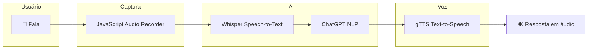

# Assistente de Voz Multi Idiomas Com Whisper e ChatGPT DIO

🎙️ Assistente de Voz Multi-Idiomas com Whisper e ChatGPT

Este projeto implementa um Assistente de Voz Inteligente Multi-Idiomas, capaz de ouvir, compreender e responder ao usuário utilizando áudio, integrando tecnologias modernas de:

- Speech-to-Text (Reconhecimento de fala)
- Inteligência Artificial Conversacional
- Text-to-Speech (Síntese de voz)

A solução utiliza Whisper e ChatGPT da OpenAI, combinados com Google Text-to-Speech, criando um fluxo completo de interação por voz semelhante a assistentes virtuais modernos.

---

🚀 Demonstração
▶️ Executar no Google Colab

https://colab.research.google.com/drive/1CvUY7spBGvfF2OmSerHl-E7mCJPuf2gh?usp=sharing

📚 Bootcamp

Projeto desenvolvido durante o bootcamp:

Bradesco - IA Generativa e Dados (DIO)

https://web.dio.me/track/bradesco-genai-dados

---

## 🧠 Arquitetura do Sistema



Esse pipeline permite criar aplicações conversacionais por voz em tempo real.

---

⚙️ Fluxo de Funcionamento

🎤 1. Captura de Áudio

O áudio do usuário é capturado diretamente no navegador utilizando:

MediaStream Recording API (JavaScript)

Essa abordagem permite gravar áudio no browser sem necessidade de upload manual de arquivos.

---

🧠 2. Transcrição de Fala (Speech-to-Text)

O áudio capturado é enviado para o Whisper, modelo da OpenAI especializado em reconhecimento de fala.

Principais vantagens:

- Alta precisão
- Suporte a múltiplos idiomas
- Detecção automática de idioma
- Capacidade de tradução

---

🤖 3. Processamento com IA


O texto transcrito é enviado para a API do ChatGPT, responsável por:

- Interpretar a pergunta
- Entender o contexto
- Gerar respostas inteligentes

---

🔊 4. Conversão da Resposta em Voz

A resposta gerada é convertida para áudio utilizando Google Text-to-Speech (gTTS).

Isso permite que o assistente responda por voz ao usuário.

---

▶️ 5. Reprodução do Áudio

O áudio final é reproduzido diretamente no Google Colab, completando o ciclo de interação.

---

🌍 Suporte a Múltiplos Idiomas

O sistema suporta múltiplos idiomas graças ao uso do Whisper e gTTS.

Basta alterar a variável de idioma para que o assistente funcione em diferentes línguas.

Exemplos possíveis:

Português
Inglês
Espanhol
Francês
Alemão
Italiano

Isso permite criar assistentes globais adaptáveis.

---

🧰 Tecnologias Utilizadas
Linguagens
- Python
- JavaScript
Inteligência Artificial
- Whisper (OpenAI) – Speech-to-Text
- ChatGPT API – Processamento de linguagem natural
Síntese de voz
- Google Text-to-Speech (gTTS)
Ferramentas
- Google Colab
- MediaStream Recording API

---

## 📁 Estrutura do Projeto

```
assistente-voz-whisper-chatgpt
│
├── README.md                # Documentação do projeto
├── assistente_voz.ipynb     # Notebook principal com o assistente
│
└── assets                   # Arquivos visuais do projeto
    ├── arquitetura.png      # Diagrama de arquitetura
    └── exemplo_fluxo.png    # Ilustração do fluxo do sistema
```
---

▶️ Como Executar o Projeto

1️⃣ Abrir o Google Colab

Acesse o notebook:

https://colab.research.google.com/drive/1CvUY7spBGvfF2OmSerHl-E7mCJPuf2gh

---

2️⃣ Configurar API Key da OpenAI

No código, adicione sua chave:

OPENAI_API_KEY = "sua_api_key"

3️⃣ Executar as células

Execute o notebook passo a passo para:

1. Gravar áudio
2. Transcrever com Whisper
3. Processar com ChatGPT
4. Gerar resposta em áudio

---

🎯 Objetivo do Projeto

Este projeto foi desenvolvido com objetivo educacional e experimental, explorando aplicações de IA generativa aplicada à voz.

Possíveis aplicações:

- Assistentes virtuais
- Sistemas de atendimento automatizado
- Interfaces conversacionais
- Ferramentas de acessibilidade
- Aplicações de IA em tempo real

---

⚠️ Observações

Para executar o projeto é necessário:

- API Key da OpenAI
- Conexão com internet
- Ambiente Google Colab

Dependendo do uso, custos podem ser gerados pelas APIs da OpenAI.

---

👨‍💻 Autor

Lucas Fernandes

PCD auditivo, usuário de implante coclear e apaixonado por tecnologia, dados e inteligência artificial.

Experiência em:

- Dashboards Power BI/Looker Studio
- Engenharia de Dados/Analista de Dados
- Automação de Processos
- Projetos com IA

📍 Franca - SP

---

📜 Licença

Este projeto é destinado para fins educacionais e experimentais.

Verifique também as licenças das bibliotecas utilizadas.

---

© 2026 Lucas Fernandes
Todos os direitos reservados
